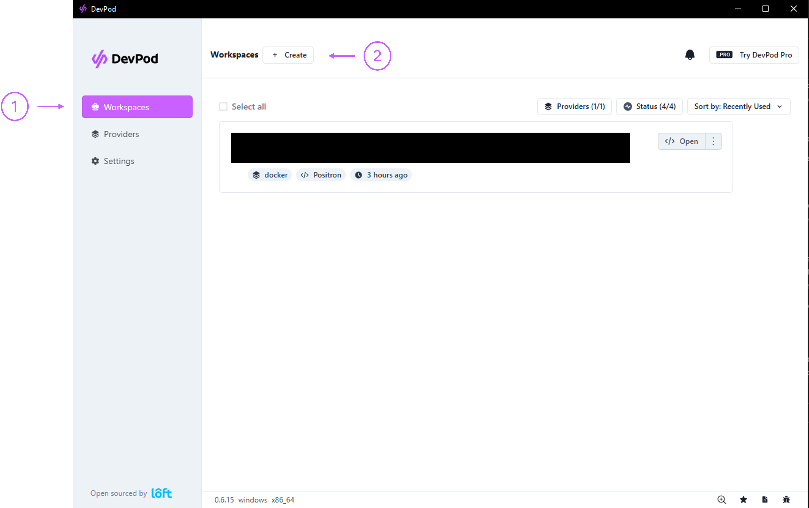
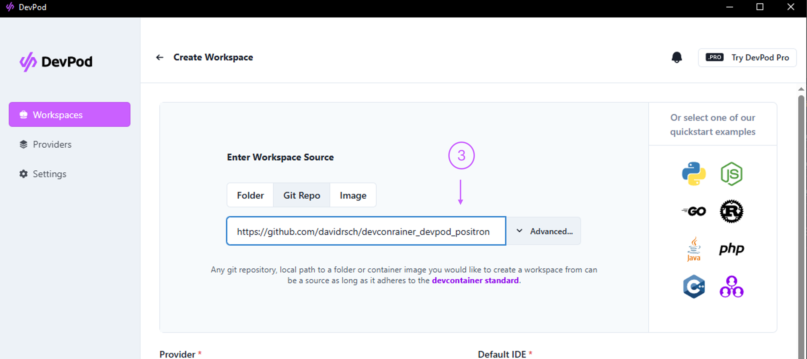
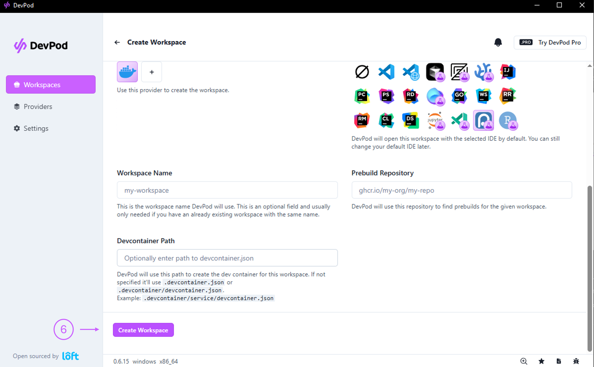
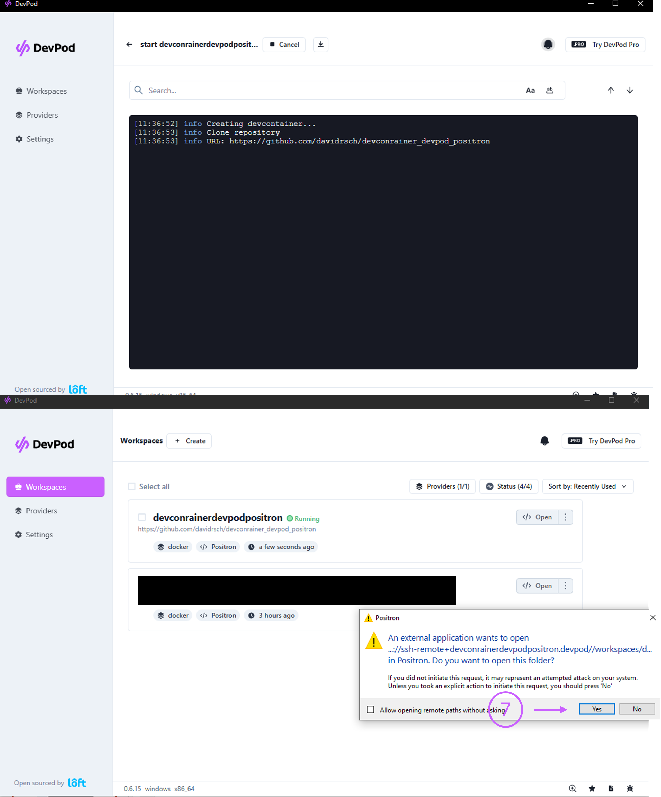
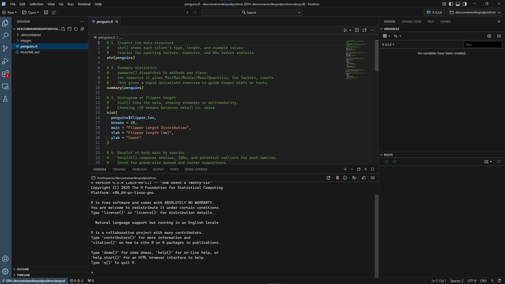

# devconrainer_devpod_positron

A repository with a simple example and instructions on how to launch a dev container in Positron IDE using DevPod

## Summary

Launching a development container in Positron IDE via DevPod involves four core stages: ensuring prerequisites (Docker Desktop, DevPod, and Positron IDE) are in place; configuring DevPod’s provider; creating and customizing a workspace; and finally selecting Positron as your IDE and starting the container. DevPod leverages the open devcontainer.json standard to define reproducible environments that run in Docker (or other backends) and can automatically open in your chosen IDE.

## Prerequisites
* Docker installed and running. Docker Desktop provides a GUI dashboard and the Docker daemon required to run containers locally.

* DevPod installed, either via the Desktop application or CLI. DevPod orchestrates your devcontainers using the devcontainer.json spec and can target local Docker, Kubernetes, SSH hosts, or cloud providers. 

* Positron IDE installed on your machine. Positron is a next-generation, polyglot data-science IDE built on Code OSS; ensure you have downloaded the appropriate installer for your OS.

## Steps
1. **Start Docker Desktop**

    1. Launch the Docker Desktop application from your OS menu or system tray.

2. **Open DevPod**

    1. If you installed the DevPod Desktop app, launch it from your applications folder or start menu.

    2. Alternatively, ensure the devpod CLI is on your PATH and run devpod in a terminal to confirm it’s available

3. **Create a Workspace**

    1. Go to the Workspaces view and click Create.

    

    2. Enter a Git repository URL or select a local folder containing your project.

    

    3. DevPod will detect (or you can provide) a .devcontainer/devcontainer.json file; if none exists, DevPod auto-generates a sane default

4. **Add/Select a Provider and a default IDE**

    1. In the Providers section in Workspaces → Add, and choose docker from the default list. This tells DevPod to spin up containers on your local Docker daemon. Choose Positron IDE from the dropdown so DevPod will open this IDE when the workspace is ready.

    

6. **Launch the Dev Container**

    1. Click Create Workspace. Under the hood, DevPod runs devpod up <your-workspace> to build (or pull) and start the container.

    

    2. Once the container is up, DevPod automatically connects and opens your project in Positron via SSH.

    

7. **Verify and Develop**

    1. In Positron, confirm the remote interpreter or runtime provided by the container is active.

    

    2. Make code changes, install dependencies in your devcontainer.json, and rebuild the container with Rebuild or devpod up (recreate as needed).